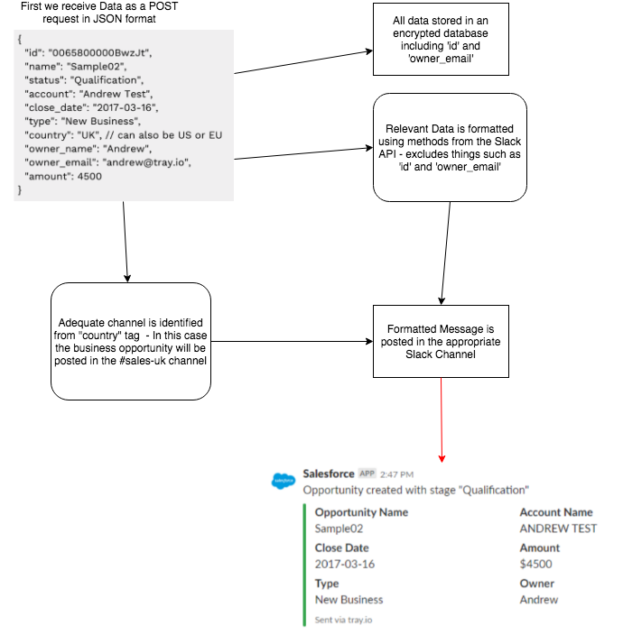

# ImplementationTest

## Purpose
The aim of this implementation is to receive data regarding business opportunities in JSON format and use methods from the Slack API to automatically post these to the relevant channel in Slack. These messages will be posted in a more legible format and will be sent to the appropriate #sales channel depending on the "country" tag in the JSON post request.

## Overview

## Explanation
### Config
1. The slack Workspace will need to have Incoming Webhooks enabled by going to
   Settings -> Incoming Webhooks -> Activate Incoming Webhooks.
2. Now you will be able to create Webhooks, please ensure that these are in
   JSON format.

### Requirements
1. We will need a database in order to store other information about business
   opportunities such as the ID to easily search for and access them.

### Methods Used
1. We can use methods such as auth.test in order to ensure only certain people can post webhooks.
2. We would use chat.postMessage with the correct arguments in order to post the message to the channel.
3. We would allow for methods such as chat.delete and chat.update to be used in case the business opportunity no longer needs to be followed or needs to be altered.

### Questions
Some follow-up questions to ensure that everyone is on the same page:
* Could we explain anything further to you?
* Are you satisfied with the outcome of this implementation?
* Is there anything further you would like us to add or anything you would rather we did differently?
